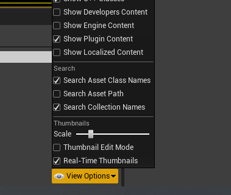

# Advanced Monitor Plugin
This is currently in an early state! Don't sue me if your computer catches fire!


## Intro
This plugin aims to add some color grading-friendly monitors for keeping an eye on your exposure and levels while grading or adjusting exposure inside of UE4.

These tools are implemented using PostProcess materials and custom HLSL nodes. This is intended to be for editor use only but nothing is stopping you from shipping a runtime with these materials enabled.

## Quick-start
Download or clone this directory into a `Plugins` directory of your UE4 project.
A complete path might look like:
```
...my-project/Plugins/AdvancedMonitor
```

Then just open your project in UE4, `Edit -> Plugins` and look for the AdvancedMonitor plugin to enable it.

To access the materials, make sure you enable `Show Plugin Content` in your asset browser:


There is a sample scene to show the idea. Basically, instantiate the included material and add it to your PostProcess stack.

## Features
<hr>

### Waveform

A luma-based waveform which can tell you where your levels are falling using Rec. 709 coefficients for the RGB luma-weighting. Use this for checking your overall exposure.
<hr>
<br/>

### RGB Parade

Separates the waveform into individual RGB channels so you can easily balance individual channels. Use this for adjusting white balance or keeping an eye on the relative strength of individual channels.
<hr>
<br>

### Various grading tools

In addition to the monitors, there is a second material with various grading controls that don't come stock with UE4 such as channel mixing. You can add this material to your post-process stack simultaneously with the monitor material.

## Notes
Note that because they are running naively in pixel shaders and involve a lot of texture fetches, performance may not be ideal. If you're comfortable hacking with HLSL, I left the shaders as pretty hackable and tried to `#DEFINE` variables that could have an impact on performance. Don't be afraid to play around.

Lastly - originally I wanted to package these as shaders directly injected into the render post-process pipeline as compute shaders, but because of a limitation of the current UE4 API, plugins cannot do this. So, in the interest of making the plugin share-able, I've opted for this slightly less performant approach of PostProcess materials.

## Changelog

0.8.0 Initial release